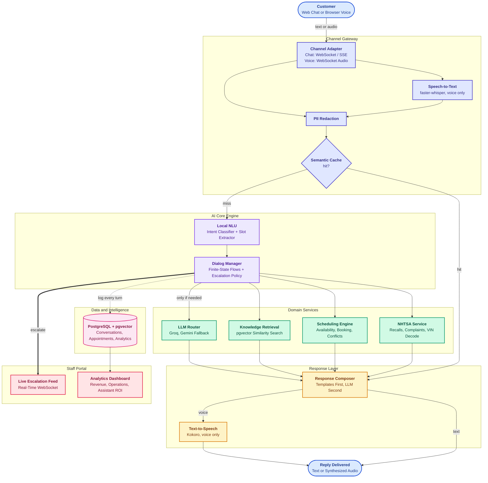

# Meridian Assist

**AI-powered chat and voice customer support for automotive dealership service centers.**

Meridian Assist handles live NHTSA recall checks, real appointment booking, warranty and
pricing questions, and safety-triggered human escalation, all backed by a staff portal for
live conversation monitoring, escalation triage, and revenue and operations analytics.


---

## Overview

Dealership service centers field a high volume of repetitive customer contact: booking
requests, recall lookups, status checks, and warranty questions, alongside a smaller but
higher-stakes stream of safety concerns and complaints that genuinely need a person. Meridian
Assist is a full-stack reference platform that answers the repetitive volume through a local,
mostly zero-cost AI pipeline, while routing anything ambiguous, safety-related, or explicitly
requested straight to a human, with full context already attached.

It is built as a production-shaped system, not a demo shortcut: real database-backed
scheduling with conflict checks, a trained local intent classifier, live third-party data
(NHTSA, vPIC), role-based access control with mandatory MFA for admins, and a tested,
containerized deployment path.

## Objectives

- **Resolve routine requests without an LLM call.** Booking, rescheduling, cancellation, and
  recall checks are deterministic flows: local intent classification, slot extraction, and
  real scheduling logic, at zero marginal token cost.
- **Escalate the right things, quickly.** Safety concerns, low-confidence turns, repeated
  slot-filling failure, and negative sentiment streaks all route to a human, with the
  full conversation context handed off automatically.
- **Keep the LLM path cheap and resilient.** Free-text questions a deterministic flow can't
  answer go through a primary/fallback LLM router (Groq, then Gemini), with a hard budget and
  graceful degradation to human handoff if both providers are unavailable.
- **Give staff a real operating picture.** A live portal for triage plus analytics dashboards
  for revenue, operations, technician performance, and assistant containment, so the system's
  impact is measurable, not asserted.
- **Prove it, don't just build it.** Backend coverage, an NLU evaluation report, a 50-scenario
  conversation regression suite, end-to-end browser tests, and a load test all ship alongside
  the code, not as an afterthought.

## What We Build

| Component | Description |
| --- | --- |
| **Public website** | Services, locations, warranty information, a live NHTSA recall quick check, and a multi-step booking wizard. |
| **Chat and voice assistant** | Local NLU (intent + slots), real-time speech-to-text and sentence-streamed text-to-speech with barge-in, and an LLM fallback only when a deterministic flow can't answer. |
| **Escalation pipeline** | Confidence-, sentiment-, and safety-triggered handoff to a human, with a live WebSocket feed into the staff portal, no polling. |
| **Staff portal** | Executive overview, revenue analytics, operations analytics, technician performance, recall and safety insights, live conversations, escalation triage, appointment management, and a knowledge base editor. |
| **Identity and access** | JWT-based staff authentication, TOTP MFA (mandatory for admin), and a role/permission matrix enforced on every protected endpoint. |
| **Deployment profile** | Multi-stage, non-root Docker images, Caddy with automatic HTTPS, a nightly Postgres backup job, and a documented free-tier deployment path. |

## How It Helps

- **Lower cost per contact.** The deterministic flows that cover the bulk of real dealership
  traffic (booking, recall checks, status lookups) run entirely on local models and rule-based
  extraction, so the marginal cost of an additional conversation is effectively zero.
- **Faster response, fewer dropped requests.** A customer gets an immediate, accurate answer
  for common questions instead of waiting on hold or a callback queue.
- **Nothing urgent gets lost in a queue.** Safety language and low-confidence conversations are
  detected and escalated automatically, with the assistant's own transcript and reasoning
  attached, so the advisor picking it up isn't starting cold.
- **Staff see the whole operation, not just their own queue.** The same platform that talks to
  customers also feeds the analytics staff use to run the business: containment rate, revenue
  by category and location, technician utilization, and recall exposure.
- **The reference data is real, not illustrative.** Recall, complaint, and VIN data comes from
  NHTSA's own APIs; the knowledge base is authored, dealership-accurate content, not filler
  text.

## Architecture

The diagram below shows the full request path, from a customer's message through the AI
core, out to the domain services and data layer, and into the staff-facing surfaces. A
narrative walkthrough and the per-service breakdown live in
[docs/architecture.md](docs/architecture.md).



**Reading the diagram:**

- **Blue (Customer)** is the entry point: a browser session over chat or voice.
- **Indigo (Channel Gateway)** normalizes the channel, transcribes audio if needed, strips PII
  before anything is cached or sent to an LLM, and checks the semantic response cache first.
- **Purple (AI Core Engine)** only runs on a cache miss: local intent classification and slot
  extraction feed a finite-state dialog manager that also owns the escalation policy.
- **Green (Domain Services)** are called as needed. The LLM router is the one path that costs
  tokens, and it is reached only when no deterministic flow or template can answer.
- **Amber (Response Layer)** composes the reply, preferring a template over a raw LLM
  completion, and synthesizes speech for voice sessions.
- **Pink (Data and Intelligence)** is the system of record: every turn is logged to
  PostgreSQL with pgvector for retrieval.
- **Rose (Staff Portal)** receives escalations in real time over WebSocket and reads from the
  same Postgres instance to power the analytics dashboards.

Booking is the clearest illustration of the "no LLM call" path: intent classification, slot
filling, real availability computation, and confirmation are all deterministic code, verified
directly by an assertion in `backend/tests/test_scripted_conversations.py` that checks the
average LLM calls per turn across 50 scripted conversations.

### Backend layout (`backend/app/`)

- `api/v1/`: routers for `auth`, `chat`, `voice`, `public`, `appointments`, `staff`,
  `analytics`, `admin`, `test_console`.
- `core/`: settings, password/TOTP/session-token handling, the role-to-permission matrix, rate
  limiting, and typed problem-details exceptions.
- `db/`: async SQLAlchemy models and the Alembic migration chain.
- `services/`: `nlu/`, `dialog/`, `llm/`, `nhtsa/`, `scheduling/`, `voice/`, `channel/`, plus
  `kb_admin.py`, `escalation_workflow.py`, `rbac.py`, `settings_store.py`, and `retrieval.py`.

### Frontend layout (`frontend/src/`)

- `pages/`: public marketing and booking pages, plus `pages/portal/` for the staff console.
- `components/`: `ChatWidget.tsx` and `VoiceModal.tsx` for the customer-facing assistant,
  `components/ui/` for design-system primitives, and `components/portal/` for charts, KPI
  cards, and the date-range picker.
- `lib/`: the public and authenticated API clients, auth context, and formatting helpers.

## Tech Stack

| Layer | Technology | License |
| --- | --- | --- |
| Backend | Python 3.12, FastAPI, Uvicorn, Pydantic v2 | MIT / BSD |
| ORM and migrations | SQLAlchemy 2.x (async), Alembic, asyncpg | MIT |
| Database | PostgreSQL 16 with pgvector | PostgreSQL License |
| Embeddings | BAAI/bge-small-en-v1.5 via sentence-transformers | MIT |
| Intent classifier | scikit-learn Logistic Regression on embeddings | BSD |
| Sentiment | distilbert-base-uncased-finetuned-sst-2-english (ONNX) | Apache 2.0 |
| LLM providers | Groq (`openai/gpt-oss-20b`), Google Gemini (Flash) | Free tier |
| Speech-to-text | faster-whisper | MIT |
| Text-to-speech | Kokoro (`kokoro-onnx`) | Apache 2.0 |
| Auth | PyJWT, argon2-cffi, pyotp (TOTP MFA) | MIT |
| Frontend | React, TypeScript, Vite | MIT |
| Charts | Apache ECharts | Apache 2.0 |
| Maps | Leaflet + OpenStreetMap tiles | BSD / ODbL |
| Testing | pytest, Vitest, React Testing Library, Playwright, Locust | MIT / Apache |
| Quality and security | ruff, bandit, pip-audit, npm audit, OWASP ZAP | Free |
| Containerization | Docker, Docker Compose, Caddy (automatic HTTPS) | Apache 2.0 |

## Prerequisites

- Docker and Docker Compose (for `make up`), or Python 3.12 and Node 20+ for local development.
- 8 GB RAM recommended (local embedding, STT, and TTS models run on CPU).
- Free API keys (optional, enables the LLM fallback for free-text questions):
  - **Groq:** create an account at [console.groq.com](https://console.groq.com) and generate an
    API key.
  - **Gemini:** create an API key in [Google AI Studio](https://aistudio.google.com).
  - Both are optional. Without them, deterministic flows (booking, reschedule, recall check)
    still work fully, and free-text questions escalate to a human instead of failing.

## Quick Start

```bash
git clone <repo-url> && cd servicedesk-ai
make setup      # creates the backend/frontend virtualenvs and installs dependencies
make data       # downloads and builds the reference and synthetic datasets
make train      # trains the local intent classifier
make up          # docker compose: Postgres, backend, frontend, Caddy, nightly backup
```

Or run everything locally without Docker: `make migrate seed dev` (starts the backend and
frontend dev servers together).

### Environment Variables

| Variable | Where | Purpose |
| --- | --- | --- |
| `DATABASE_URL` | `backend/.env` | Postgres connection string |
| `JWT_SECRET`, `JWT_REFRESH_SECRET` | `backend/.env` | Access/refresh token signing |
| `PII_ENCRYPTION_KEY` | `backend/.env` | Column-level encryption for PII fields |
| `GROQ_API_KEY`, `GEMINI_API_KEY` | `backend/.env` | LLM provider keys (optional) |
| `CORS_ORIGINS` | `backend/.env` | Allowed frontend origin(s) |
| `VITE_API_BASE` | `frontend/.env` | Backend URL for local dev (empty/relative in the Docker Compose deployment) |
| `DOMAIN`, `POSTGRES_*` | `infra/.env` | Docker Compose deployment: public hostname and database credentials |

Copy `infra/.env.example` to `infra/.env` before `make up`.

### Seeded Demo Credentials

| Role | Email | Password | MFA |
| --- | --- | --- | --- |
| Admin | admin@meridianauto.example | MeridianDemo!Admin1 | Required |
| Service manager | manager@meridianauto.example | MeridianDemo!Mgr1 | Optional |
| Service advisor | advisor@meridianauto.example | MeridianDemo!Adv1 | Optional |
| Analyst | analyst@meridianauto.example | MeridianDemo!Analyst1 | Optional |

Run `make seed` to create these (real, random TOTP secrets are printed to the console on
first seed; save them if you need to log in as admin).

## Dataset

Real NHTSA recall, complaint, and VIN data, EPA fuel economy data, an authored dealership
knowledge base, and 36 months of synthetic operational data (appointments, repair orders,
CSAT). Sources, licenses, and attribution are in
[dataset/DATA_CARD.md](dataset/DATA_CARD.md). Regenerate the full pipeline from a clean
clone with `make data`.

## LLM Strategy

Deterministic flows (booking, reschedule, cancel, recall check, status lookups) never call an
LLM. Free-text questions the dialog manager can't answer deterministically go to Groq first,
falling back to Gemini on a transient error; if neither is configured or both are down, the
conversation escalates to a human instead of failing (verified directly in
`backend/tests/test_scripted_conversations.py`'s provider-outage scenarios). Per-provider
daily request budgets and the primary/fallback order are runtime settings
(`app/services/settings_store.py`), editable from the admin portal without a redeploy.

## Security Overview

- **Authentication:** JWT access/refresh tokens for staff, a scoped anonymous session token
  for public chat/voice; TOTP MFA mandatory for admin.
- **Authorization:** role-to-permission matrix in `backend/app/core/permissions.py`, enforced
  per endpoint and tested exhaustively in `backend/tests/test_rbac_matrix.py`.
- **Encryption:** PII columns encrypted at rest; passwords hashed with argon2.
- **PII redaction:** `backend/app/services/pii.py` strips sensitive data from text before it
  reaches the response cache or an LLM call.
- **Data retention and scan results:** bandit, pip-audit, npm audit, and OWASP ZAP results are
  documented in [docs/security.md](docs/security.md).

## API

The full generated API reference is served directly from a running backend: Swagger UI at
`/docs`, ReDoc at `/redoc`, and the raw schema at `/openapi.json`. An endpoint-group overview
is in [docs/api.md](docs/api.md).

## Testing and Evaluation

- **Backend:** 226+ pytest tests, at least 80 percent coverage of `app/services/`
  (`make test`, `backend/htmlcov/` for the HTML report).
- **NLU:** accuracy, macro-F1, confusion matrix, and escalation-gate precision/recall in
  [docs/nlu-evaluation.md](docs/nlu-evaluation.md).
- **Conversation regression:** 50 scripted dialogs enforcing an average LLM-calls-per-turn
  budget (`backend/tests/test_scripted_conversations.py`).
- **Frontend:** Vitest and React Testing Library component tests (`cd frontend && npm test`);
  Playwright end-to-end tests for recall check, booking wizard, chat booking, staff login with
  MFA, escalation handling, and dashboard filters (`make e2e`).
- **Voice latency:** [docs/voice-benchmark.md](docs/voice-benchmark.md).
- **Load:** Locust, 100 concurrent simulated chat users, p95 latency target under 400 ms for
  non-LLM turns (`backend/loadtest/locustfile.py`).

## Project Structure

```
backend/app/       FastAPI app: api/v1 routers, core (config/security/RBAC), db (models,
                    migrations), services (nlu, dialog, llm, nhtsa, scheduling, voice, ...)
backend/tests/      pytest suite
backend/scripts/    training, evaluation, and one-off admin scripts
frontend/src/       React app: public pages, staff portal, chat/voice widgets, design system
frontend/e2e/       Playwright end-to-end tests
dataset/            download/build scripts, reference data, DATA_CARD.md
infra/              docker-compose.yml, Caddyfile, .env.example
docs/               architecture, api, security, NLU evaluation, demo script, and more
```

## Troubleshooting

- **Chat returns 429 Too Many Requests:** the chat endpoint is rate-limited to 20
  messages/minute per IP. This is expected under heavy manual testing from one machine; wait a
  minute, or run the Locust load test with `DISABLE_RATE_LIMIT=1` (never set this in a
  deployed environment).
- **A make/model doesn't autocomplete:** vehicle makes and models come live from NHTSA's vPIC
  API; obscure or very new models may use a different name than colloquial usage (for example
  trim variants folded into one model name). The recall check and booking wizard both use the
  same live lookup, so behavior is consistent between them.
- **No microphone prompt in voice mode:** browsers only grant microphone access on a secure
  context (HTTPS, or `localhost`). Check the browser's site permissions if the prompt never
  appears.
- **Login stuck needing an MFA code with no way to get one:** only the seeded admin account has
  MFA enabled by default; `make seed` prints each account's real TOTP secret to the console on
  first run.

## Known Limitations

- Kokoro TTS and faster-whisper models must be present under `models/` (mounted as a volume in
  `infra/docker-compose.yml`); there is no automated first-boot downloader for Kokoro's weights
  yet, only for faster-whisper's (which downloads itself on first use).
- OWASP ZAP and Lighthouse were not run in this environment (no deployed, internet-reachable
  instance); both are documented as gaps rather than skipped silently, in
  [docs/security.md](docs/security.md).
- The confidence-based escalation gate is one signal among several (slot-filling failure,
  negative sentiment streak, explicit human request); see
  [docs/nlu-evaluation.md](docs/nlu-evaluation.md) for why its standalone precision/recall
  numbers look modest in isolation.

## Roadmap

- Telephony channel adapter (the `ChannelAdapter` interface already supports adding one
  without touching the dialog manager).
- Piper TTS as a second local fallback behind Kokoro.
- Multi-process deployment support for the portal's live event feed (currently in-process
  pub/sub, documented in `app/services/dialog/portal_feed.py` as swappable for Postgres
  LISTEN/NOTIFY or Redis).

## License

MIT. See [LICENSE](LICENSE). Third-party dataset licenses (Bitext CDLA-Sharing-1.0, NHTSA and
EPA public domain, stock photo licenses) are documented separately in
[dataset/DATA_CARD.md](dataset/DATA_CARD.md) and [docs/CREDITS.md](docs/CREDITS.md), since
they govern the data and assets, not the code.
