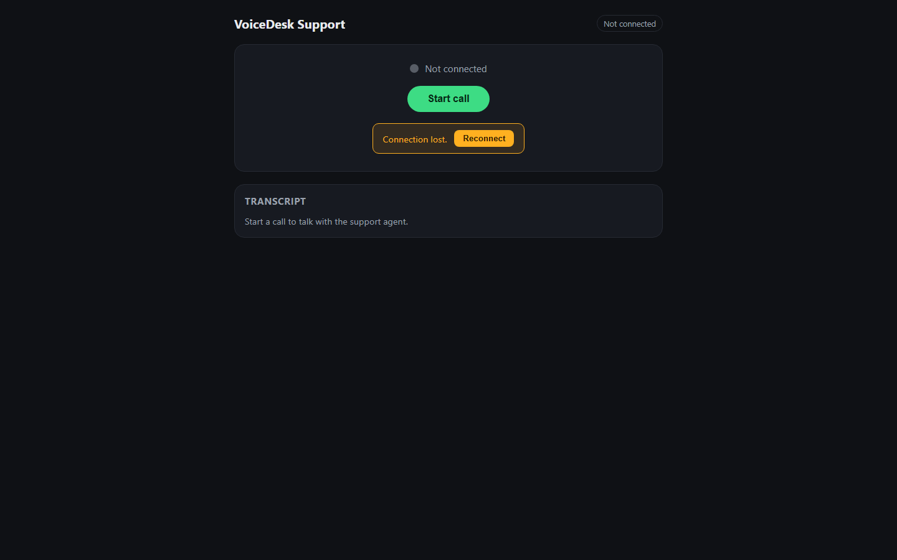

# Meridian Assist

AI-powered chat and voice customer support for automotive dealership service centers:
recall checks against live NHTSA data, real appointment booking, warranty and pricing
questions, and safety-triggered human escalation, backed by a staff portal for live
conversations, escalations, and revenue/operations analytics.



## Features

- Public site: services, locations, warranty info, a live NHTSA recall quick check, and a
  multi-step booking wizard.
- Chat and voice assistant: local intent classification and slot extraction (zero LLM tokens
  for deterministic flows like booking, reschedule, and recall check), real-time
  speech-to-text and sentence-streamed text-to-speech with barge-in, and an LLM fallback
  (Groq, then Gemini) only for free-text questions a deterministic flow can't answer.
- Safety and confidence-based escalation to a human, with a live staff portal (WebSocket
  updates, no polling) for triage and resolution.
- Staff portal analytics: executive overview, revenue, operations, technician performance,
  recall insights, and assistant containment/ROI, all with date-range filtering and CSV
  export.
- Role-based access control (admin, service manager, service advisor, analyst) with
  mandatory MFA for admin.

### Architecture

See [docs/architecture.md](docs/architecture.md) for the full request-flow diagram and
service-by-service breakdown. In short:

```
Customer (web chat / browser voice)
  -> channel adapter -> PII redaction -> semantic response cache
  -> local NLU (intent + slots) -> dialog manager / escalation policy
     -> NHTSA service | scheduling engine | knowledge retrieval | LLM router (only if needed)
  -> response composer -> (voice only) text-to-speech
  -> logged to Postgres -> staff portal analytics
```

## Tech stack

| Layer | Technology | License |
| --- | --- | --- |
| Backend | Python 3.12, FastAPI, Uvicorn, Pydantic v2 | MIT / BSD |
| ORM and migrations | SQLAlchemy 2.x (async), Alembic, asyncpg | MIT |
| Database | PostgreSQL 16 with pgvector | PostgreSQL License |
| Embeddings | BAAI/bge-small-en-v1.5 via sentence-transformers | MIT |
| Intent classifier | scikit-learn Logistic Regression on embeddings | BSD |
| Sentiment | distilbert-base-uncased-finetuned-sst-2-english (ONNX) | Apache 2.0 |
| LLM providers | Groq (`openai/gpt-oss-20b`), Google Gemini (Flash) | Free tier |
| Speech-to-text | faster-whisper | MIT |
| Text-to-speech | Kokoro (`kokoro-onnx`) | Apache 2.0 |
| Auth | PyJWT, argon2-cffi, pyotp (TOTP MFA) | MIT |
| Frontend | React, TypeScript, Vite | MIT |
| Charts | Apache ECharts | Apache 2.0 |
| Maps | Leaflet + OpenStreetMap tiles | BSD / ODbL |
| Testing | pytest, Vitest, React Testing Library, Playwright, Locust | MIT / Apache |
| Quality and security | ruff, bandit, pip-audit, npm audit, OWASP ZAP | Free |
| Containerization | Docker, Docker Compose, Caddy (automatic HTTPS) | Apache 2.0 |

## Prerequisites

- Docker and Docker Compose (for `make up`), or Python 3.12 and Node 20+ for local dev
- 8 GB RAM recommended (local embedding, STT, and TTS models run on CPU)
- Free API keys (optional, enables the LLM fallback for free-text questions):
  - Groq: create an account at [console.groq.com](https://console.groq.com) and generate an
    API key.
  - Gemini: create an API key in [Google AI Studio](https://aistudio.google.com).
  - Both are optional. Without them, deterministic flows (booking, reschedule, recall check)
    still work fully, and free-text questions escalate to a human instead of failing.

## Quick start

```bash
git clone <repo-url> && cd servicedesk-ai
make setup      # creates the backend/frontend virtualenvs and installs dependencies
make data       # downloads and builds the reference and synthetic datasets
make train      # trains the local intent classifier
make up         # docker compose: Postgres, backend, frontend, Caddy, nightly backup
```

Or run everything locally without Docker: `make migrate seed dev` (starts the backend and
frontend dev servers together).

### Environment variables

| Variable | Where | Purpose |
| --- | --- | --- |
| `DATABASE_URL` | `backend/.env` | Postgres connection string |
| `JWT_SECRET`, `JWT_REFRESH_SECRET` | `backend/.env` | Access/refresh token signing |
| `PII_ENCRYPTION_KEY` | `backend/.env` | Column-level encryption for PII fields |
| `GROQ_API_KEY`, `GEMINI_API_KEY` | `backend/.env` | LLM provider keys (optional) |
| `CORS_ORIGINS` | `backend/.env` | Allowed frontend origin(s) |
| `VITE_API_BASE` | `frontend/.env` | Backend URL for local dev (empty/relative in the Docker Compose deployment) |
| `DOMAIN`, `POSTGRES_*` | `infra/.env` | Docker Compose deployment: public hostname and database credentials |

Copy `infra/.env.example` to `infra/.env` before `make up`.

### Seeded demo credentials

| Role | Email | Password | MFA |
| --- | --- | --- | --- |
| Admin | admin@meridianauto.example | MeridianDemo!Admin1 | Required |
| Service manager | manager@meridianauto.example | MeridianDemo!Mgr1 | Optional |
| Service advisor | advisor@meridianauto.example | MeridianDemo!Adv1 | Optional |
| Analyst | analyst@meridianauto.example | MeridianDemo!Analyst1 | Optional |

Run `make seed` to create these (real, random TOTP secrets are printed to the console on
first seed; save them if you need to log in as admin).

## Dataset

Real NHTSA recall/complaint/VIN data, EPA fuel economy data, an authored dealership knowledge
base, and 36 months of synthetic operational data (appointments, repair orders, CSAT).
Sources, licenses, and attribution are in [dataset/DATA_CARD.md](dataset/DATA_CARD.md).
Regenerate the full pipeline from a clean clone with `make data`.

## LLM strategy

Deterministic flows (booking, reschedule, cancel, recall check, status lookups) never call an
LLM. Free-text questions the dialog manager can't answer deterministically go to Groq first,
falling back to Gemini on a transient error; if neither is configured or both are down, the
conversation escalates to a human instead of failing (verified directly in
`backend/tests/test_scripted_conversations.py`'s provider-outage scenarios). Per-provider
daily request budgets and the primary/fallback order are runtime settings
(`app/services/settings_store.py`), editable from the admin portal without a redeploy.

## Security overview

- Authentication: JWT access/refresh tokens for staff, a scoped anonymous session token for
  public chat/voice; TOTP MFA mandatory for admin.
- Authorization: role -> permission matrix in `backend/app/core/permissions.py`, enforced per
  endpoint and tested exhaustively in `backend/tests/test_rbac_matrix.py`.
- Encryption: PII columns encrypted at rest; passwords hashed with argon2.
- PII redaction: `backend/app/services/pii.py` strips sensitive data from text before it
  reaches the response cache or an LLM call.
- Data retention and full scan results (bandit, pip-audit, npm audit, OWASP ZAP): see
  [docs/security.md](docs/security.md).

## API

Full generated reference at `/docs` (Swagger UI), `/redoc`, and `/openapi.json` on a running
backend. Endpoint-group overview: [docs/api.md](docs/api.md).

## Testing and evaluation

- Backend: 219+ pytest tests, at least 80 percent coverage of `app/services/`
  (`make test`, `backend/htmlcov/` for the HTML report).
- NLU: accuracy, macro-F1, confusion matrix, escalation gate precision/recall in
  [docs/nlu-evaluation.md](docs/nlu-evaluation.md).
- Conversation regression: 50 scripted dialogs enforcing an average LLM-calls-per-turn budget
  (`backend/tests/test_scripted_conversations.py`).
- Frontend: Vitest + React Testing Library component tests (`cd frontend && npm test`);
  Playwright E2E for recall check, booking wizard, chat booking, staff login with MFA,
  escalation handling, and dashboard filters (`make e2e`).
- Voice latency: [docs/voice-benchmark.md](docs/voice-benchmark.md).
- Load: Locust, 100 concurrent simulated chat users, p95 latency target under 400 ms for
  non-LLM turns (`backend/loadtest/locustfile.py`).

## Project structure

```
backend/app/       FastAPI app: api/v1 routers, core (config/security/RBAC), db (models,
                    migrations), services (nlu, dialog, llm, nhtsa, scheduling, voice, ...)
backend/tests/      pytest suite
backend/scripts/    training, evaluation, and one-off admin scripts
frontend/src/       React app: public pages, staff portal, chat/voice widgets, design system
frontend/e2e/       Playwright end-to-end tests
dataset/            download/build scripts, reference data, DATA_CARD.md
infra/              docker-compose.yml, Caddyfile, .env.example
docs/               architecture, api, security, NLU evaluation, demo script, and more
```

## Troubleshooting

- **Chat returns 429 Too Many Requests**: the chat endpoint is rate-limited to 20
  messages/minute per IP (Section 2.4). This is expected under heavy manual testing from one
  machine; wait a minute, or run the Locust load test with `DISABLE_RATE_LIMIT=1` (never set
  this in a deployed environment).
- **A make/model doesn't autocomplete**: vehicle makes and models come live from NHTSA's
  vPIC API; obscure or very new models may use a different name than colloquial usage (for
  example trim variants folded into one model name). The recall check and booking wizard
  both use the same live lookup, so behavior is consistent between them.
- **No microphone prompt in voice mode**: browsers only grant microphone access on a secure
  context (HTTPS, or `localhost`). Check the browser's site permissions if the prompt never
  appears.
- **Login stuck needing an MFA code with no way to get one**: only the seeded admin account
  has MFA enabled by default; `make seed` prints each account's real TOTP secret to the
  console on first run.

## Known limitations

- Kokoro TTS and faster-whisper models must be present under `models/` (mounted as a volume
  in `infra/docker-compose.yml`); there is no automated first-boot downloader for Kokoro's
  weights yet, only for faster-whisper's (which downloads itself on first use).
- OWASP ZAP and Lighthouse were not run in this environment (no deployed, internet-reachable
  instance); both are documented as gaps rather than skipped silently, in
  [docs/security.md](docs/security.md).
- The confidence-based escalation gate is one signal among several (slot-filling failure,
  negative sentiment streak, explicit human request); see
  [docs/nlu-evaluation.md](docs/nlu-evaluation.md) for why its standalone precision/recall
  numbers look modest in isolation.

## Roadmap

- Telephony channel adapter (the `ChannelAdapter` interface already supports adding one
  without touching the dialog manager).
- Piper TTS as a second local fallback behind Kokoro.
- Multi-process deployment support for the portal's live event feed (currently in-process
  pub/sub, documented in `app/services/dialog/portal_feed.py` as swappable for Postgres
  LISTEN/NOTIFY or Redis).

## License

MIT. See [LICENSE](LICENSE). Third-party dataset licenses (Bitext CDLA-Sharing-1.0, NHTSA and
EPA public domain, stock photo licenses) are documented separately in
[dataset/DATA_CARD.md](dataset/DATA_CARD.md) and [docs/CREDITS.md](docs/CREDITS.md), since
they govern the data and assets, not the code.
